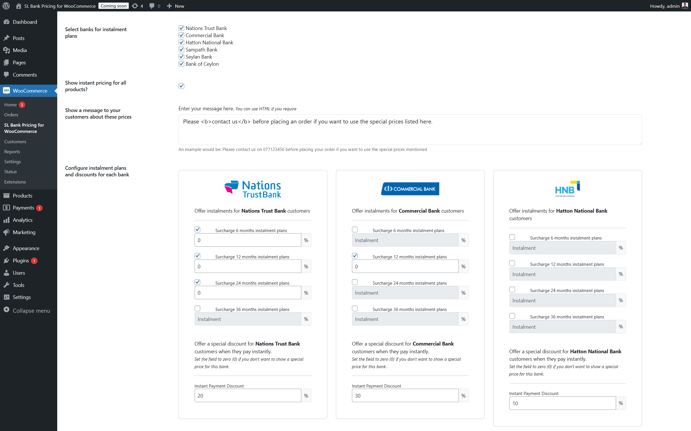
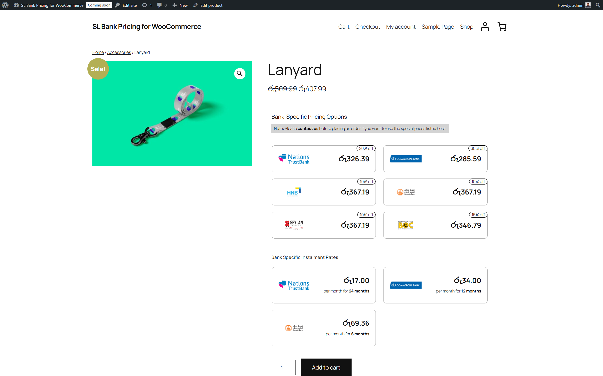

=== SL Bank Pricing for WooCommerce ===
Contributors: minhazmohamed
Donate link: https://minhazimohamed.com
Tags: WooCommerce, Sri Lanka, Pricing, Installments
Requires at least: 5.8
Tested up to: 6.7
Requires PHP: 7.4
Stable tag: 1.0.0
License: GPLv2 or later
License URI: https://www.gnu.org/licenses/gpl-2.0.html

# SL Bank Pricing for WooCommerce

**SL Bank Pricing for WooCommerce** is a plugin that allows WooCommerce store admins to offer special pricing and installment plans for Sri Lankan bank customers. This plugin integrates seamlessly with WooCommerce, enabling custom pricing options for specific banks, including installment and instant payment plans.

## Description

With **SL Bank Pricing for WooCommerce**, store owners can:

- Enable special pricing for products for Sri Lankan bank customers.
- Configure installment and instant payment options for supported banks.

The plugin is user-friendly and integrates fully with WooCommerce's existing pricing and checkout systems, making it easier for customers to view and use special pricing based on their bank.

## Screenshots

1. **Configure Installment and Instant Pricing**  
   Admin view for setting up special pricing options for different Sri Lankan banks.

   

2. **Product Page View**  
   Front-end view of the special pricing and installment options displayed to customers.

   

## Installation

1. **From the WordPress Dashboard**:

   - Navigate to **Plugins > Add New**.
   - Search for `SL Bank Pricing for WooCommerce`.
   - Click **Install Now**, and then **Activate**.

2. **Manual Installation**:
   - Download the plugin ZIP file from the WordPress plugin repository.
   - Upload the ZIP file via **Plugins > Add New > Upload Plugin** in your WordPress dashboard.
   - Activate the plugin.

## Configuration

### Enabling Special Pricing

1. Go to **WooCommerce > SL Bank Pricing Settings**.
2. Check the **Enable Special Pricing** box to override regular product pricing.

### Configuring Banks

- Select which Sri Lankan banks will have special pricing options:
  - Nations Trust Bank
  - Commercial Bank
  - Hatton National Bank
  - Sampath Bank
  - Seylan Bank
  - Bank of Ceylon

### Setting Payment Options

For each bank, you can configure:

1. **Installment Plans**: Define terms and surcharges for installments.
2. **Instant Payment Options**: Offer discounts or direct bank transfer options.

## Usage

Once configured:

- Customers will see special pricing and payment options (installments, instant payments) on eligible product pages.
- Options are also displayed at checkout for customers selecting an eligible bank.

## Frequently Asked Questions (FAQ)

### 1. How do I enable special pricing?

Go to **WooCommerce > SL Bank Pricing Settings** and check the **Enable Special Pricing** option.

### 2. Can I select multiple banks for installment plans?

Yes, you can select any combination of the supported banks.

### 3. Does this plugin affect regular pricing?

Only when **Special Pricing** is enabled. Regular pricing remains unaffected otherwise.

## Changelog

### 1.0.0

- Initial release.

## License

This plugin is licensed under the [GPL-2.0 License](https://www.gnu.org/licenses/gpl-2.0.html). You are free to modify and redistribute the plugin under the terms of this license.
